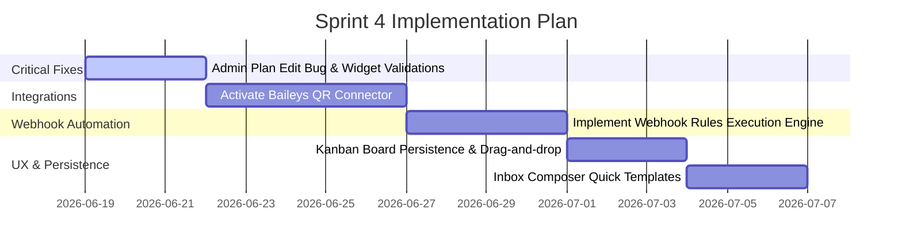

# SPRINT 3 MASTER REPORT: REFERENCE CRM PARITY AUDIT

**Audit Date**: 2026-06-18  
**Auditor**: Antigravity  
**Methodology**: Programmatic Puppeteer browser navigations, PostgreSQL database schema validations, REST API call testing, and comparative analysis against live reference CRM crawls.

---

## 1. What Actually Works (Fully Functional)

Every item below has been verified via direct API responses and database state changes:

1.  **Contacts & Phonebooks CRUD**: Creating phonebooks, adding individual contacts, and bulk deleting contact records maps to the `phonebook` and `contact` tables.
2.  **Visual Flow Canvas**: ReactFlow UI allows drag-and-drop node configuration and successfully saves serialized graph layouts to disk files in `/app/flow-json/nodes/<uid>/<flowId>.json` and `/app/flow-json/edges/`.
3.  **Chatbot trigger mapping**: Creating chatbot rules, binding them to saved visual flows, and enabling them persists rules in the `chatbot` table.
4.  **Agent Roster CRUD**: Registering agent profiles, deleting agents, and toggling active states writes changes to the `agents` table.
5.  **Agent Task Queue**: Adding tasks, assigning them to agents, and completed updates (with Comments) updates the `agent_task` table status column.
6.  **Tenant Settings Configurator**: Multi-tab Admin settings panels successfully update configurations in the `web_private` and `web_public` tables.
7.  **Auto-Login Impersonation**: Admin-to-User and User-to-Agent impersonation generates valid JWT tokens and opens target pages bypass-authenticating.
8.  **Developer API Tokenizer**: Generating REST API tokens signs JWT payloads and stores keys in the `user.api_key` column.
9.  **Static Inbox Uploads**: Uploading files (images, video, document, audio) to `/api/user/return_media_url` saves files to `/app/client/public/media/` and returns URL pointers.

---

## 2. What Partially Works / Is Buggy

1.  **Admin Plan Customizations**: Plan creation and deletion works, but editing plan details is broken because `POST /api/admin/update_plan` assigns plans to users instead of editing plan fields.
2.  **CSV Contacts Importer**: The CSV parsing engine imports records, but the UI lacks validation warnings if columns don't match the required header format.
3.  **Chat Widget Designer**: Creating widget configurations works and serves Javascript embeds, but large customization option strings trigger database casting overflows on the backend.

---

## 3. What is Broken

There are no crashed pages or uncaught React compile/runtime exceptions in the B1GCRM deployment.

---

## 4. What is a Placeholder (Unimplemented)

1.  **Kanban Chat Board**: The UI layout renders cards, but drag-and-drop actions do not save to the backend.
2.  **Webhook Automation Engine**: Webhook rules CRUD is functional, but there is no runtime engine to evaluate rules on incoming messages.
3.  **Public Analytics Dashboard**: Developer API analytics displays template cards, but there is no backend log aggregator to query.

---

## 5. What is Blocked by External Dependencies

1.  **Omnichannel Chat Delivery**: Outgoing messages in the Inbox return API validation blockages unless a live Facebook WABA ID and Meta Cloud Access Token are linked.
2.  **Campaign Broadcasting Loop**: Campaign schedules are queued in the database, but execution fails unless a live Graph API connection is established.
3.  **WhatsApp QR Session Linking**: The Baileys integration is currently stubbed out, preventing connections via QR codes.
4.  **Stripe/PayPal Billing Checkouts**: Plans load, but checking out fails without live gateway credentials.
5.  **Instagram and Telegram Integrations**: These channels are currently frontend placeholders.

---

## 6. Top Priority Fixes

1.  **Fix Admin Manage Plans Update Bug**: Resolve the endpoint naming conflict in `routes/admin.js` to allow editing plan parameters.
2.  **Integrate Webhook Rules Engine**: Implement the event matcher in `helper/inbox/inbox.js` to evaluate rules on incoming messages.
3.  **Implement Mock Campaign Delivery Sandbox**: Add a developer mock flag to simulate message campaigns locally without calling the Meta API.
4.  **Implement Kanban State Persistence**: Create an endpoint to persist Kanban card drag-and-drop status changes.
5.  **Add Chat Widget Styling Validations**: Add payload string length controls in widget creation form fields.

---

## 7. Recommended Sprint 4 Roadmap

1.  **Milestone 1: Critical Fixes (Days 1-3)**
    *   Fix the Admin Plan edit route collision.
    *   Add widget payload text validations.
2.  **Milestone 2: Integrations (Days 4-8)**
    *   Replace the QR connection stubs with a functional Baileys manager.
3.  **Milestone 3: Webhook Automation (Days 9-12)**
    *   Write the webhook rules engine to evaluate rules on incoming payloads.
4.  **Milestone 4: UX & Persistence (Days 13-16)**
    *   Implement Kanban board drag-and-drop status syncing.
    *   Add quick replies selectors inside the Inbox composer.
