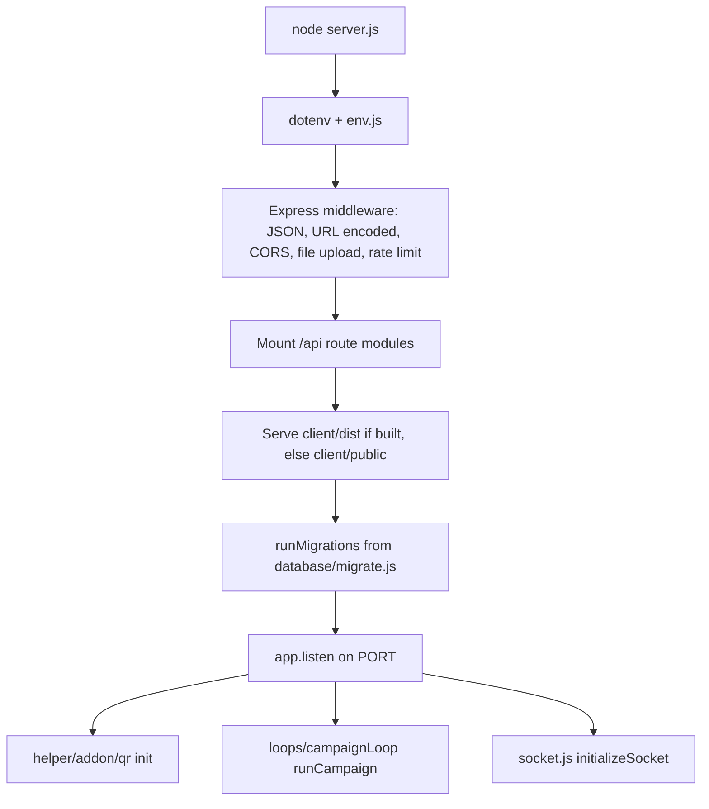

# AI Context

Last audited: 2026-06-15

This is the primary AI context file for B1G-CRM. Read it first, then jump to the linked detail docs when the task touches a specific area.

## Project Purpose

B1G-CRM is a multi-tenant B2B SaaS WhatsApp CRM. It provides:

| Area | Purpose |
| --- | --- |
| Admin portal | SaaS operations: plans, users, orders, CMS, SMTP, payment gateways, social login, site/theme settings. |
| User portal | Tenant workspace: inbox, contacts, campaigns, Meta WhatsApp setup, QR instances, chatbot/flow builder, agents, billing, API/webhooks, chat widgets. |
| Agent portal | Restricted staff workspace for assigned chats and tasks. |
| Public website | Marketing/public pages, pricing, contact form, and portal entry points. |

## Tech Stack

| Layer | Stack |
| --- | --- |
| Backend | Node.js CommonJS, Express, PostgreSQL, Socket.IO, JWT, bcrypt, file upload middleware. |
| Frontend | Vite, React 19, React Router 7, Zustand, React Icons, React Flow via `@xyflow/react`, Jest/RTL. |
| Database | PostgreSQL with SQL migrations under `database/migrations`. |
| Realtime | Active server: `socket.js`. Legacy/alternate server: `websocket.js`. |
| Integrations | Meta WhatsApp Cloud API, Baileys QR add-on stubs, Stripe, Razorpay, PayPal, Paystack, SMTP, webhook rules. |
| Deployment | Multi-stage Dockerfile plus `docker-compose.yml` with PostgreSQL. |

## Entry Points

| File | Role |
| --- | --- |
| `server.js` | Express bootstrap, middleware, route mounts, migration startup, QR init, campaign loop, Socket.IO init, static frontend serving. |
| `env.js` | Central server configuration and feature flags. |
| `database/migrate.js` | Runtime migration runner. Called by `server.js` before listening. |
| `database/config.js` | PostgreSQL `pg.Pool` setup. |
| `database/dbpromise.js` | MySQL-style `?` placeholder adapter for PostgreSQL queries. |
| `socket.js` | Active Socket.IO server and emit helpers. |
| `client/src/main.jsx` | React app mount. |
| `client/src/App.jsx` | Browser router and auth provider wrapper. |
| `client/src/routes/AppRoutes.jsx` | Public/admin/user/agent route definitions. |
| `client/src/shared/api.js` | Fetch helper used by current pages. |
| `client/src/shared/auth.jsx` | Role token storage and `RoleGate`. |

## Startup Flow

## Architecture Summary

The backend is organized around route modules in `routes/`. Most route modules import legacy role validators from `middlewares/user.js`, `middlewares/admin.js`, or `middlewares/agent.js`, plus plan checks from `middlewares/plan.js`.

The frontend is a Vite SPA with public routes plus three protected portal branches. The active page code mostly calls `client/src/shared/api.js` and stores role tokens in local storage under `b1gcrm-auth`.

Persistence is hybrid:

- PostgreSQL stores users, plans, CMS/settings, contacts, chats, campaigns, flows, chatbots, tasks, widgets, webhook rules, and logs.
- Conversation message bodies are JSON files in `conversations/inbox/<uid>/<chatId>.json`.
- Flow builder node/edge JSON is stored in `flow-json/nodes/<uid>/<flowId>.json` and `flow-json/edges/<uid>/<flowId>.json`.
- Media is stored under `client/public/media` and `client/public/meta-media` when present.

## Folder Map

| Path | Meaning |
| --- | --- |
| `client/` | Vite React SPA. |
| `routes/` | Express route modules mounted from `server.js`. |
| `middlewares/` | Active legacy auth/plan middleware plus a newer unified auth helper that is not wired into route modules. |
| `database/` | PostgreSQL config, query adapter, schema files, migrations. |
| `functions/` | Broad backend utility and business logic helpers. |
| `helper/` | Active helper tree used by current socket/inbox/chatbot/QR code. |
| `helpers/` | Older/alternate helper tree; some parts import `websocket.js` and appear legacy. |
| `loops/` | Campaign scheduler and template send logic. |
| `emails/` | Password recovery email HTML helpers. |
| `languages/` | JSON translation files. |
| `flow-json/` | Runtime flow node/edge JSON storage. |
| `conversations/` | Runtime conversation JSON storage. |
| `sessions/`, `contacts/`, `logs/` | Runtime folders used by sessions, imports, and logger output. |
| `docs/` | AI-focused living documentation. |

## Current Implementation Status

| Area | Status | Notes |
| --- | --- | --- |
| Backend route surface | Partial production shape | Many CRM routes exist; some endpoints are debug/legacy or use broad JSON responses. |
| Frontend shell | Implemented | Admin, user, and agent routing exists with protected portal layouts. |
| Admin portal | Partial | Plans/users/orders/settings screens call real APIs; several reference routes render planned placeholders. |
| User portal | Partial | Dashboard, inbox, contacts, campaigns, flows, chatbot, integrations, agents, widgets, billing, API/webhooks have UI/API wiring. |
| Agent portal | Partial | Agent dashboard loads identity, assigned chats, and tasks; restricted chat actions exist. |
| Meta WhatsApp | Partial | Cloud API credential storage, template actions, message send, webhooks, and campaigns exist. |
| QR WhatsApp | Stubbed/partial | Routes and UI exist, but `helper/addon/qr/index.js` currently exports no-op session functions and `checkQr()` returns false. |
| Database | Migration-backed | `database/migrations` is the reliable source. `database/schema.sql` is not complete versus migrations. |
| Docker | Implemented | Builds backend and frontend, runs PostgreSQL, persists app runtime dirs. |
| Testing | Frontend baseline only | `client` has Jest/RTL tests. Root `npm test` is a placeholder that exits 1. |

See [CURRENT_STATUS.md](CURRENT_STATUS.md) and [FEATURE_TRACKER.md](FEATURE_TRACKER.md).

## Major Modules

| Module | Files |
| --- | --- |
| Admin SaaS/CMS | `routes/admin.js`, `routes/web.js`, `client/src/pages/admin/*` |
| User workspace/auth/billing | `routes/user.js`, `client/src/pages/user/*`, `client/src/pages/auth/*` |
| Agent workflow | `routes/agent.js`, `middlewares/agent.js`, `client/src/pages/agent/Dashboard.jsx` |
| Inbox/realtime | `routes/inbox.js`, `socket.js`, `helper/socket/*`, `helper/inbox/*` |
| Chatbot/flow builder | `routes/chatFlow.js`, `routes/chatbot.js`, `functions/chatbot.js`, `helper/chatbot/meta/*`, `client/src/pages/user/AutomationFlows.jsx`, `client/src/pages/user/ChatBot.jsx` |
| Campaigns | `routes/broadcast.js`, `loops/campaignLoop.js`, `loops/loopFunctions.js`, `client/src/pages/user/Campaigns.jsx` |
| Contacts | `routes/phonebook.js`, `client/src/pages/user/Contacts.jsx` |
| API/webhooks | `routes/apiv2.js`, `routes/webhooks.js`, `client/src/pages/user/DeveloperApi.jsx` |
| QR | `routes/qr.js`, `helper/addon/qr/*`, `client/src/pages/user/Integrations.jsx` |

## Authentication Flow

Active route modules use role-specific legacy middleware:

| Role | Login route | Validator | Token payload |
| --- | --- | --- | --- |
| Admin | `POST /api/admin/login` | `middlewares/admin.js` | `uid`, `role: admin`, `password`, `email` |
| User | `POST /api/user/login` | `middlewares/user.js` | `uid`, `role: user`, `password`, `email` |
| Agent | `POST /api/agent/login` | `middlewares/agent.js` | `uid`, `role: agent`, `password`, `email`, `owner_uid` |

Important: the validators verify the JWT and then match `email` plus the stored password hash from the token against the database. If a password changes, old tokens become invalid. Agent validation also checks `is_active` and loads the owner user into `req.owner`.

## Database Summary

PostgreSQL tables are created by migrations in sorted order. There are no explicit foreign key constraints in the current migrations; relationships are enforced by route queries using `uid`, `owner_uid`, `chat_id`, and similar fields. See [DATABASE.md](DATABASE.md).

## Docker Summary

`Dockerfile` builds backend dependencies, builds the Vite client, copies `client/dist`, and runs `node server.js`. `docker-compose.yml` starts PostgreSQL 16 and the app, maps port `3010` by default, and persists runtime folders using named volumes. See [DOCKER_SETUP.md](DOCKER_SETUP.md).

## Environment Variables

Server env is centralized in `env.js` and documented in [.env.example](../.env.example). Frontend env is documented in [client/.env.local.example](../client/.env.local.example). See [ENVIRONMENT.md](ENVIRONMENT.md).

## Common Commands

| Command | Purpose |
| --- | --- |
| `npm install` | Install backend dependencies. |
| `npm run dev` | Run backend with nodemon. |
| `npm start` | Run backend with Node. |
| `npm run db:migrate` | Apply SQL migrations. |
| `cd client; npm install` | Install frontend dependencies. |
| `cd client; npm run dev` | Run Vite dev server. |
| `cd client; npm run build` | Build production frontend. |
| `cd client; npm test` | Run frontend Jest tests. |
| `docker compose up --build` | Build and run app plus PostgreSQL. |

## Important Warnings

| Warning | Why it matters |
| --- | --- |
| Do not treat `database/schema.sql` as complete. | Later app tables are created by migrations, especially `002_create_core_app_tables.sql`. |
| Do not assume QR is functional. | `helper/addon/qr/index.js` currently exports stubs/no-ops. |
| Do not remove legacy files casually. | Some duplicate `helper/` and `helpers/` trees exist; verify imports before editing. |
| Do not change token payloads casually. | Active validators rely on `email`, `password`, and `role` inside tokens. |
| Do not store conversation-only data only in PostgreSQL. | Actual message history is JSON-file backed. |
| Keep docs updated after each successful change. | This folder is intended as persistent AI memory. |
| Keep sample secrets empty. | Older commits used realistic placeholders that trigger secret scanners. |

## How To Safely Modify

1. Read this file and the module doc for the touched area.
2. Verify active imports before editing duplicate helper trees.
3. For APIs, update route file, frontend caller, [API_REFERENCE.md](API_REFERENCE.md), and tests when relevant.
4. For schema changes, add a new migration under `database/migrations`, then update [DATABASE.md](DATABASE.md).
5. For frontend routes, update `client/src/routes/AppRoutes.jsx`, navigation where needed, page tests, and [MODULES.md](MODULES.md).
6. Run the narrowest useful verification. For frontend UI changes, prefer `cd client; npm test` or targeted tests.
7. Update the required living docs listed in [AI_DOC_UPDATE_PROTOCOL.md](AI_DOC_UPDATE_PROTOCOL.md).

## Frequently Changed Files

| Area | Files |
| --- | --- |
| API route work | `routes/*.js`, `client/src/pages/user/*`, `client/src/shared/api.js` |
| Auth/session work | `routes/user.js`, `routes/admin.js`, `routes/agent.js`, `middlewares/*.js`, `client/src/shared/auth.jsx` |
| Schema work | `database/migrations/*.sql`, `database/dbpromise.js` |
| Inbox/socket work | `socket.js`, `helper/socket/*`, `routes/inbox.js`, `client/src/pages/user/Inbox.jsx` |
| Flow/chatbot work | `routes/chatFlow.js`, `routes/chatbot.js`, `functions/chatbot.js`, `helper/chatbot/meta/*` |
| Campaign work | `routes/broadcast.js`, `loops/*`, `client/src/pages/user/Campaigns.jsx` |
| Docs memory | `docs/*.md`, `CLAUDE.md` |

## Frequently Used APIs

| API | Use |
| --- | --- |
| `POST /api/user/login` | User login. |
| `GET /api/user/get_me` | Tenant profile, plan, addons, contact count. |
| `GET /api/inbox/get_chats` | Tenant chat list. |
| `POST /api/inbox/send_text` | Send WhatsApp text from user inbox. |
| `GET /api/chat_flow/get_mine` | Tenant flow list. |
| `POST /api/chatbot/add_chatbot` | Create chatbot from saved flow. |
| `POST /api/broadcast/add_new` | Create scheduled campaign. |
| `GET /api/user/generate_api_keys` | Generate tenant API key for `/api/v1`. |
| `GET /api/webhooks/rules` | Tenant webhook automation rules. |
| `POST /api/user/auto_agent_login` | User creates agent portal token. |

## Living Docs Index

| Doc | Use |
| --- | --- |
| [PROJECT_OVERVIEW.md](PROJECT_OVERVIEW.md) | Product and repo overview. |
| [SYSTEM_ARCHITECTURE.md](SYSTEM_ARCHITECTURE.md) | Backend/frontend/request/socket/startup flows. |
| [FOLDER_STRUCTURE.md](FOLDER_STRUCTURE.md) | Directory map. |
| [DATABASE.md](DATABASE.md) | Tables, indexes, migrations, relationships. |
| [API_REFERENCE.md](API_REFERENCE.md) | Route inventory. |
| [AUTH_FLOW.md](AUTH_FLOW.md) | Admin/user/agent/API-key auth. |
| [DOCKER_SETUP.md](DOCKER_SETUP.md) | Docker build/runtime details. |
| [FEATURE_TRACKER.md](FEATURE_TRACKER.md) | Feature status by area. |
| [CURRENT_STATUS.md](CURRENT_STATUS.md) | Implementation, debt, readiness. |
| [ROADMAP.md](ROADMAP.md) | Next work sequence. |
| [KNOWN_ISSUES.md](KNOWN_ISSUES.md) | Bugs, risks, and debt. |
| [CODING_GUIDELINES.md](CODING_GUIDELINES.md) | Local implementation rules. |
| [DEPENDENCIES.md](DEPENDENCIES.md) | Runtime/dev dependencies. |
| [ENVIRONMENT.md](ENVIRONMENT.md) | Server/client env variables. |
| [BUSINESS_LOGIC.md](BUSINESS_LOGIC.md) | Product workflows and rules. |
| [MODULES.md](MODULES.md) | Major module responsibilities. |
| [CHANGELOG_AI.md](CHANGELOG_AI.md) | AI-maintained changelog. |
| [AI_DOC_UPDATE_PROTOCOL.md](AI_DOC_UPDATE_PROTOCOL.md) | Required doc update rules. |
