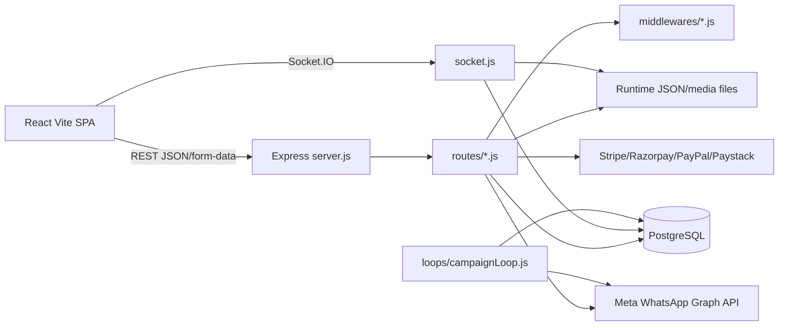
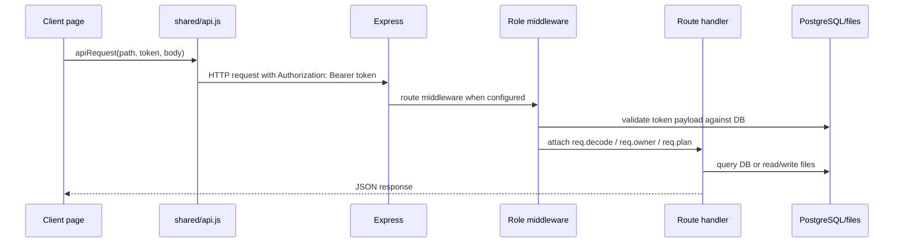
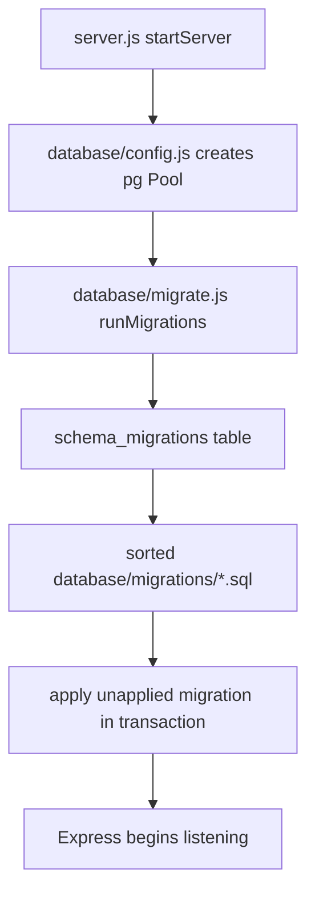
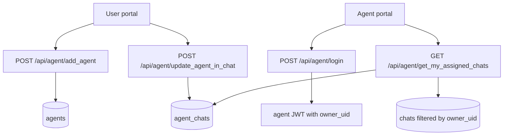
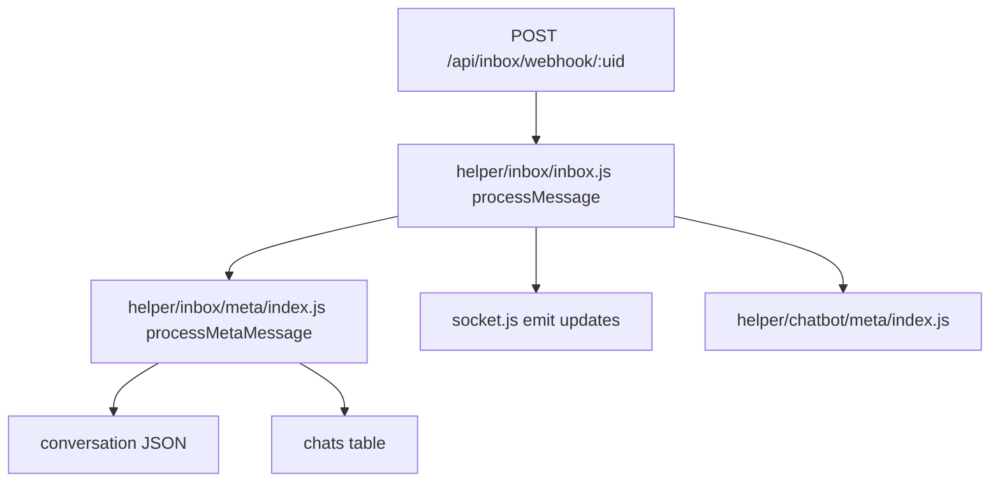
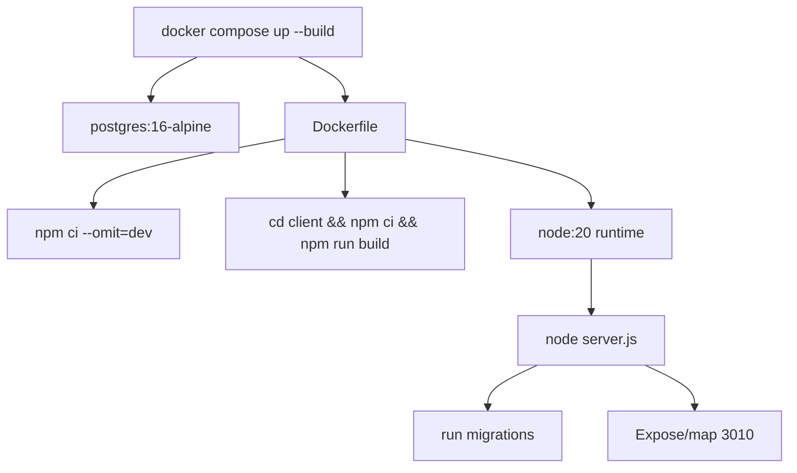

# System Architecture

Last audited: 2026-06-17

## High-Level Architecture

## Backend Architecture

| Layer | Files | Notes |
| --- | --- | --- |
| Bootstrap | `server.js` | Loads env, middleware, routes, static frontend, migrations, QR init, campaign loop, Socket.IO. |
| Configuration | `env.js` | Normalizes env vars, secrets, limits, CORS, feature flags. Throws missing secrets only in production. |
| Routes | `routes/*.js` | One route module per feature area. Mounted under `/api/*`. |
| Middleware | `middlewares/user.js`, `admin.js`, `agent.js`, `plan.js` | Active route auth and plan enforcement. |
| Database | `database/config.js`, `dbpromise.js`, `migrate.js` | PostgreSQL pool, query adapter, migration runner. |
| Business functions | `functions/function.js`, `functions/chatbot.js`, `functions/chatbotDiagnostics.js`, `functions/ai.js` | Broad helper layer for Meta, billing, files, email, chatbot, API calls. |
| Realtime | `socket.js`, `helper/socket/*`, `helper/inbox/*` | Active Socket.IO and message normalization flow. |
| Background loops | `loops/campaignLoop.js`, `loops/loopFunctions.js` | Recursive campaign queue processor. |

## Frontend Architecture

| Layer | Files | Notes |
| --- | --- | --- |
| App mount | `client/src/main.jsx` | Mounts React app. |
| Router wrapper | `client/src/App.jsx` | Wraps `BrowserRouter` and `AuthProvider`. |
| Routes | `client/src/routes/AppRoutes.jsx` | Public, admin, user, and agent route tree. |
| Layout | `client/src/layouts/PortalLayout.jsx` | Sidebar shell for protected portals. |
| Auth | `client/src/shared/auth.jsx` | Role token storage under `b1gcrm-auth`; `RoleGate`. |
| API helpers | `client/src/shared/api.js`, `client/src/utils/api.js` | Current pages mostly use `shared/api.js`; `utils/api.js` is axios/Zustand-era helper. |
| State | `client/src/store/index.js` | Zustand auth/UI/app stores, not the main current route guard. |
| Pages | `client/src/pages/**` | Portal and public screens. |

## Request Lifecycle

## Authentication Lifecycle

1. Login route validates credentials with bcrypt.
2. Route signs JWT using `env.JWT_SECRET`.
3. Payload includes `uid`, `role`, `email`, and current password hash. Agent tokens also include `owner_uid`.
4. Frontend stores role token in `localStorage` key `b1gcrm-auth`.
5. Protected frontend routes only check that a role token exists.
6. Backend route validators verify JWT and check DB record by `email` and `password` hash.
7. Agent validator checks `is_active` and loads the owner user into `req.owner`.

See [AUTH_FLOW.md](AUTH_FLOW.md).

## Database Lifecycle

`database/dbpromise.js` converts legacy `?` placeholders to PostgreSQL `$1`, `$2`, etc. It also rewrites some MySQL-style quoting and JSON extraction patterns.

## Tenant Lifecycle

| Step | Data |
| --- | --- |
| Signup/login | `user.uid`, `user.email`, bcrypt `password`, `role=user`. |
| Plan assignment | `user.plan` stores full plan JSON, `user.plan_expire` stores epoch milliseconds. |
| Workspace data | Most tenant tables use `uid`: contacts, chats, flows, chatbots, broadcasts, widgets, webhook rules. |
| Message history | `conversations/inbox/<uid>/<chatId>.json`. |
| Flow definitions | `flow-json/nodes/<uid>/<flowId>.json` and `flow-json/edges/<uid>/<flowId>.json`. |
| API access | `GET /api/user/generate_api_keys` stores a JWT in `user.api_key`. |

## Agent Workflow

Agents can also be auto-logged in by the tenant through `POST /api/user/auto_agent_login`.

## User Workflow

| Workflow | Main files |
| --- | --- |
| Login/signup | `routes/user.js`, `client/src/pages/auth/*` |
| Dashboard | `routes/user.js`, `client/src/pages/user/Dashboard.jsx` |
| Inbox | `routes/inbox.js`, `socket.js`, `client/src/pages/user/Inbox.jsx` |
| Contacts | `routes/phonebook.js`, `client/src/pages/user/Contacts.jsx` |
| Campaigns | `routes/broadcast.js`, `loops/campaignLoop.js`, `client/src/pages/user/Campaigns.jsx` |
| Flow/chatbot | `routes/chatFlow.js`, `routes/chatbot.js`, `client/src/pages/user/AutomationFlows.jsx`, `client/src/pages/user/ChatBot.jsx` |
| Integrations | `routes/user.js`, `routes/qr.js`, `client/src/pages/user/Integrations.jsx` |
| Billing | `routes/user.js`, `client/src/pages/user/Billing.jsx` |
| API/webhooks | `routes/apiv2.js`, `routes/webhooks.js`, `client/src/pages/user/DeveloperApi.jsx` |

## Admin Workflow

| Workflow | Main files |
| --- | --- |
| Login | `routes/admin.js`, `client/src/pages/auth/LoginPage.jsx` |
| Dashboard | `GET /api/admin/get_dashboard_for_user`, `client/src/pages/admin/Dashboard.jsx` |
| Plans | `routes/admin.js`, `client/src/pages/admin/Plans.jsx` |
| Users | `routes/admin.js`, `client/src/pages/admin/Users.jsx` |
| Orders | `routes/admin.js`, `client/src/pages/admin/Orders.jsx` |
| CMS/settings | `routes/admin.js`, `routes/web.js`, `client/src/pages/admin/Settings.jsx` |

## CMS Workflow

CMS data lives in:

| Table/file | Purpose |
| --- | --- |
| `web_public` | Logo, app name, currency, tutorials, social login flags, RTL. |
| `web_private` | Payment gateway credentials and active flags. |
| `partners` | Partner logo filenames. |
| `faq` | FAQ entries. |
| `page` | Custom pages plus permanent terms/privacy pages. |
| `testimonial` | Testimonials. |
| `contact_form` | Public contact form leads. |
| `languages/*.json` | Translation files. |
| `routes/theme.json` | Theme JSON read/written by web routes. |

## Billing Workflow

Plan purchase/free trial data flows through `routes/user.js`:

| Provider | Route |
| --- | --- |
| Free trial | `POST /api/user/start_free_trial` |
| Stripe | `POST /api/user/create_stripe_session`, `GET /api/user/stripe_payment` |
| Razorpay | `POST /api/user/pay_with_rz` |
| PayPal | `POST /api/user/pay_with_paypal` |
| Paystack | `POST /api/user/pay_with_paystack` |

Successful payment calls `updateUserPlan()` in `functions/function.js`, writing full plan JSON and expiry to `user`.

## Notification And Socket Flow

Active Socket.IO server: `socket.js`

| Event/helper | Purpose |
| --- | --- |
| `connection_ack` | Sent to clients on connect with connection info. |
| `get_chat` | Fetch initial/limited chat list. |
| `get_chat_filter` | Fetch filtered/search chat list. |
| `on_open_chat` | Load conversation JSON and chat metadata. |
| `send_chat_message` | Send Meta/QR message from selected chat. |
| `assign_agent_to_chat` | Create/remove `agent_chats` assignment. |
| `save_chat_note` | Update `chats.chat_note`. |
| `add_label`, `on_label_delete`, `set_chat_label` | Manage labels/tags. |
| `update_chat_list`, `update_conversation`, `ring` | Server emit/update events used by helpers. |

Message ingest path:

## Docker Flow

